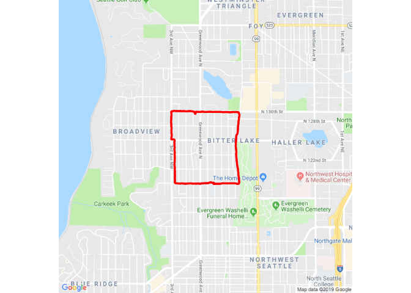
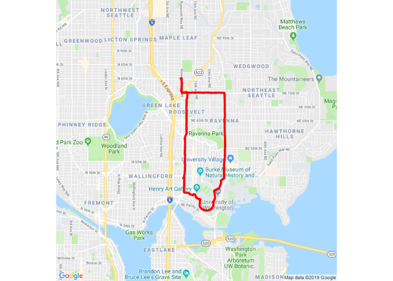
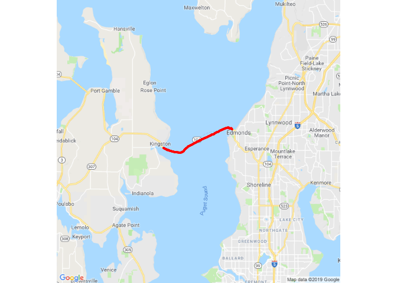

We will plot tracks from GPS files (GPX, TCX, etc.) using R and `ggmap`. 
Specifically, we will use the `get_map()` "smart function" to get the base 
map. While `get_map()` includes a zoom='auto' feature, we will develop our 
own function for determining an appropriate zoom level.

See: [get_map {ggmap}](http://www.inside-r.org/packages/cran/ggmap/docs/get_map) for more information about the features of the `get_map()` function.

## User-defined Functions for Code Reuse

As a practical example of user-defined functions, we will make several maps 
using GPS tracks. We will create several functions to reuse code which will 
perform important calculations allowing us to choose the approproate base map
location and zoom level. We will repeat the process for several GPS tracks 
on Google base maps.

## Set Options

First we will set a few `knitr` options to control document rendering.


```r
suppressPackageStartupMessages(library(knitr))
opts_chunk$set(echo=TRUE, warning=FALSE, message=FALSE, cache=FALSE)
```

## Install Packages

Then we will install `ggmap` if it is not already installed and load the 
package.


```r
if (!require(ggmap)) install.packages("ggmap", repos="http://cran.fhcrc.org")
library(ggmap)
```

## Convert GPS File to CSV

Now, we convert our GPS file to a CSV for importing into R using 
[GPSBabel](http://www.gpsbabel.org/). 

This particular GPS track was created from a smartphone using the MapMyWalk app 
and downloaded as a TCX file from the [MapMyWalk](www.mapmywalk.com) website.

The following command is run from the "shell" prompt of the computer's 
operating system, such as Bash, DOS, or PowerShell.


```bash
gpsbabel -t -i gtrnctr -f mywalk.tcx -o unicsv -F mywalk.csv
```

## Import the CSV

We can import this CSV file into R with `read.csv`.


```r
gps <- read.csv('mywalk.csv', header = TRUE)
```

## Get the Base Map

### Zoom Level

First we need to find an appropriate zoom level or scale. The zoom level 
(as defined by [Google](https://developers.google.com/maps/documentation/static-maps/intro?hl=en#Zoomlevels)) could be determined by trial-and-error, knowing 
the range should be between 0 (whole world) and 21 (building) with 10 
suggested for a "city" zoom level.


```r
zoomLevel <- 14
```

That would give us a map that was roughly twice as wide as our route area.

However, we will calculate this level from an algorithm found 
[online](http://stackoverflow.com/questions/6048975). This will allow us 
to "autozoom" our map, regardless of the size of the GPS track area we 
are using. Let's also make this calculation into a function so we can reuse it.


```r
autoZoom <- function(lon, lat) {
    globeWidth <- 256
    west <- min(lon)
    east <- max(lon)
    north <- max(lat)
    south <- min(lat)
    
    angle <- east - west
    angle2 <- north - south
    
    if (angle2 > angle) angle <- angle2
    if (angle < 0) angle <- angle + 360
    
    zoom <- floor(log(960 * 360 / angle / globeWidth) / log(2)) - 2
    return(zoom)
}

zoomLevel <- autoZoom(gps$Longitude, gps$Latitude)

zoomLevel
```

```
## [1] 14
```

This is the same zoom level we had discovered earlier by trial-and-error.

### Calculate Route Location and Size

To get the right base map location, we need to perform some more calculations. 
We want to know the center coordinates of the GPS track. We will create a 
one-line function to calculate the center point of the GPS track and map.


```r
getCenter <- function(lat, lon) c(lon = median(lon), lat = median(lat))

centerLocation <- getCenter(gps$Latitude, gps$Longitude)
```

### Google Map

Now we can get the base map using this zoomLevel and center location. 
We will make another new function for this procedure.

We can get our base map from [Google](https://www.google.com/maps). 

Let's make a function to automatically calculate the map 
[scale](http://wiki.openstreetmap.org/wiki/MinScaleDenominator) then 
execute the `get_map()` function.
 


```r
fetchMap <- function(loc, src, zoom) {
    # Calculate scale for 'osm' maps, otherwise use 1 for Google maps.
    # We need this or else many 'osm' map labels will be too small to read.
    scale <- ifelse(src == 'osm', floor(591657550.5 / 2^(zoom - 1) / 1.5), 1)
    
    map <- get_map(location=loc, 
                   source=src, 
                   color='color', 
                   maptype='roadmap', 
                   zoom=zoom,
                   scale=scale)
    return(map)
}

googleMapImageData <- fetchMap(centerLocation, 'google', zoomLevel)
```

## Plot the Track on the Map

### Google Map

Here is the GPS track plotted over a Google base map, using a function we
define.


```r
makeMap <- function(dat) {
    ggmap(dat, extent = "device") + 
    geom_point(aes(x = Longitude, y = Latitude), data = gps, 
               colour = "red", size = 1, pch = 20)
}

makeMap(googleMapImageData)
```



## Plot Another Track

We will check our zoom and scale settings with a different track. This one,
instead of being square, is longer than it is wide.


```bash
gpsbabel -t -i gtrnctr -f myride.tcx -o unicsv -F myride.csv
```

After converting `myride.tcx` to `myride.csv`, we can import into R and 
calculate the zoom level and center location.


```r
gps <- read.csv('myride.csv', header = TRUE)
zoomLevel <- autoZoom(gps$Longitude, gps$Latitude)
centerLocation <- getCenter(gps$Latitude, gps$Longitude)
```

Now we can fetch the base map.


```r
googleMapImageData <- fetchMap(centerLocation, 'google', zoomLevel)
```

And then make the map.


```r
makeMap(googleMapImageData)
```



## Plot a Third Track

As a final check that our `autoZoom()` function is working as we would like, 
let's plot a track that is wider than it is long.


```bash
gpsbabel -t -i gtrnctr -f myferryride.tcx -o unicsv -F myferryride.csv
```

After converting `myferryride.tcx` to `myferryride.csv`, we can make the maps. 


```r
gps <- read.csv('myferryride.csv', header = TRUE)
zoomLevel <- autoZoom(gps$Longitude, gps$Latitude)
centerLocation <- getCenter(gps$Latitude, gps$Longitude)
makeMap(fetchMap(centerLocation, 'google', zoomLevel))
```


