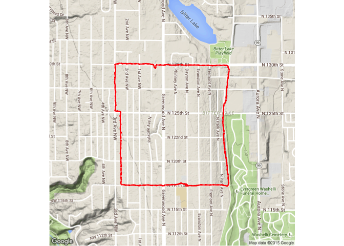
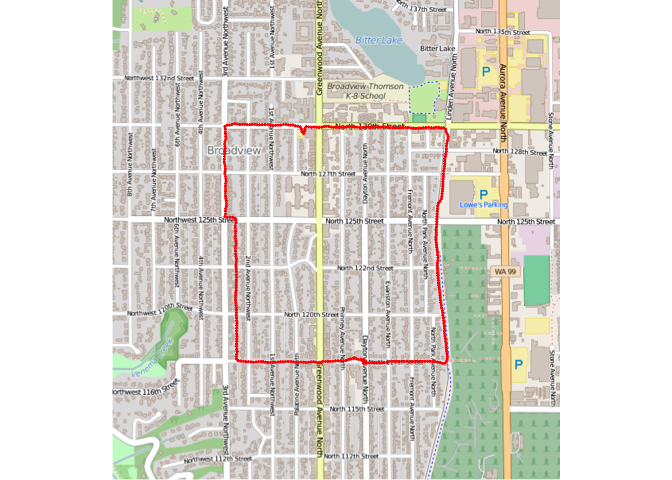

# GPS Track Demo
Brian High  
11/12/2015  

This is one way to plot a track from a GPS file (GPX, TCX, etc.) file using 
R and `ggmap`. 

Based on: 
[Mapping GPS Tracks in R](http://www.r-bloggers.com/mapping-gps-tracks-in-r/) 
by Shawn Mollie Taylor. Here is the 
[Gist](https://gist.github.com/mollietaylor/4210660).

## Set Options

First we will set a few `knitr` options to control document rendering.


```r
suppressPackageStartupMessages(library(knitr))
opts_chunk$set(echo=TRUE, warning=FALSE, message=FALSE, cache=FALSE)
```

## Install Packages

Then we will install `ggmap` if it is not already installed and load the 
package.


```r
if (!require(ggmap)) install.packages("ggmap", repos="http://cran.fhcrc.org")
library(ggmap)
```

## Convert GPS File to CSV

Now, we convert our GPS file to a CSV for importing into R using 
[GPSBabel](http://www.gpsbabel.org/). 

This particular GPS track was created from a smartphone using the MapMyWalk app 
and downloaded as a TCX file from the [MapMyWalk](www.mapmywalk.com) website.

The following command is run from the "shell" prompt of the computer's 
operating system, such as Bash, DOS, or PowerShell.


```bash
gpsbabel -t -i gtrnctr -f mywalk.tcx -o unicsv -F mywalk.csv
```

## Import the CSV

We can import this CSV file into R with `read.csv`.


```r
gps <- read.csv('mywalk.csv', header = TRUE)
```

## Get the Base Map

### Zoom Level

First we need to find an appropriate zoom level or scale. The zoom level 
(as defined by Google) could be determined by trial-and-error, knowing 
the range should be between 3 (continent) and 21 (building) with 10 
suggested for a "city" zoom level.


```r
zoomlevel <- 15
```

That would give us a map that was roughly twice as wide as our route area.

However, we will calculate this level from an algorithm found 
[online](http://stackoverflow.com/questions/6048975). This will allow us 
to "autoscale" our map, regardless of the size of the GPS track area we 
are using.


```r
GLOBE_WIDTH = 256
west <- min(gps$Longitude)
east <- max(gps$Longitude)
angle <- east - west
north <- max(gps$Latitude)
south <- min(gps$Latitude)
delta <- 0

angle2 <- north - south
if (angle2 > angle) {
    angle <- angle2
    delta <- 3
}

if (angle < 0) {
    angle <- angle + 360
}

zoomlevel <- ceiling(log(960 * 360 / angle / GLOBE_WIDTH) / log(2)) - 2 - delta;
zoomlevel
```

```
## [1] 15
```

This is the same zoom level we had discovered earlier by trial-and-error.

### Calculate Route Location and Size

To get the right base map location, we need to perform some more calculations. 
We want to know the center coordinates and the width and height of the route.


```r
centerLon <- median(gps$Longitude)
centerLat <- median(gps$Latitude)
routeWidth <- 2 * abs(east - west)
routeHeight <- 2 * abs(north - south)
```

The first two variables will be used to get the Google base map. All four 
of these variables will be used to get the OpenStreetMap base map.

### Google Map

Now we can get the base map using this zoomlevel, location, and size.

We can get our base map from [Google](https://www.google.com/maps). 


```r
googleMapImageData <- get_googlemap(
    center = c(lon = centerLon, lat = centerLat), 
    zoom = zoomlevel, maptype = c("terrain")
    )
```

### OpenStreetMap

We can also use a base map from 
[OpenStreetMap](https://www.openstreetmap.org/). 

The value we chose for scale approximates the zoom chosen for the Google Map
and was based on a [formula](http://gis.stackexchange.com/questions/7430) 
found online for converting the Google zoom level to map scale. 


```r
openStreetMapImageData <- get_openstreetmap(
    bbox = c(lowerleftlon=centerLon-routeWidth/2, 
             lowerleftlat=centerLat-routeHeight/2, 
             upperrightlon=centerLon+routeWidth/2, 
             upperrightlat=centerLat+routeHeight/2),
    scale = floor(591657550.5 / 2^(zoomlevel - 1) / 2)
    )
```

## Plot the Track on the Map

### Google Map

Here is the GPS track plotted over a Google base map.


```r
ggmap(googleMapImageData, extent = "device") + 
    geom_point(aes(x = Longitude, y = Latitude), data = gps,
               colour = "red", size = 1, pch = 20)
```

 

### OpenStreetMap

And here is the same GPS track plotted on an OpenStreetMap.


```r
ggmap(openStreetMapImageData, extent = "device") + 
    geom_point(aes(x = Longitude, y = Latitude), data = gps,
               colour = "red", size = 1, pch = 20)
```

 
